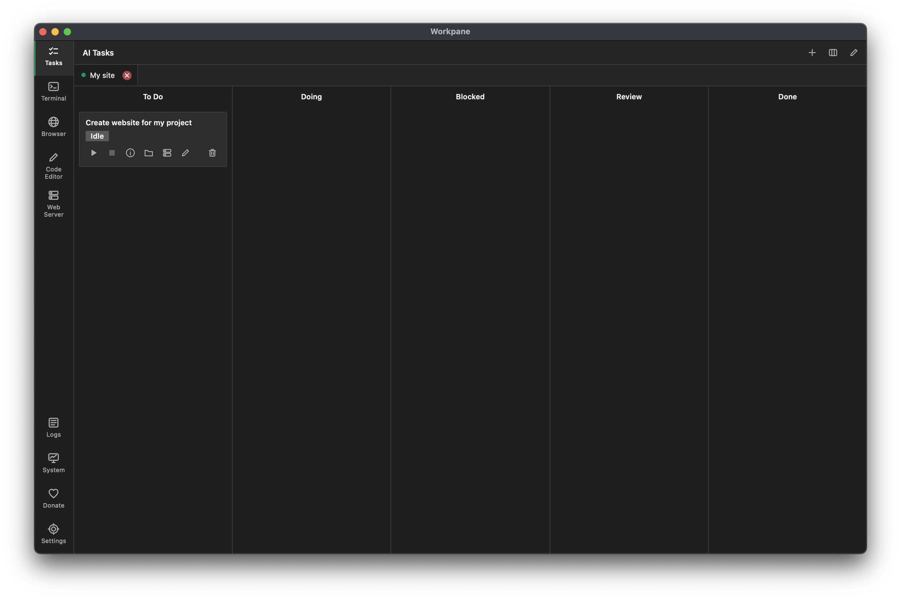
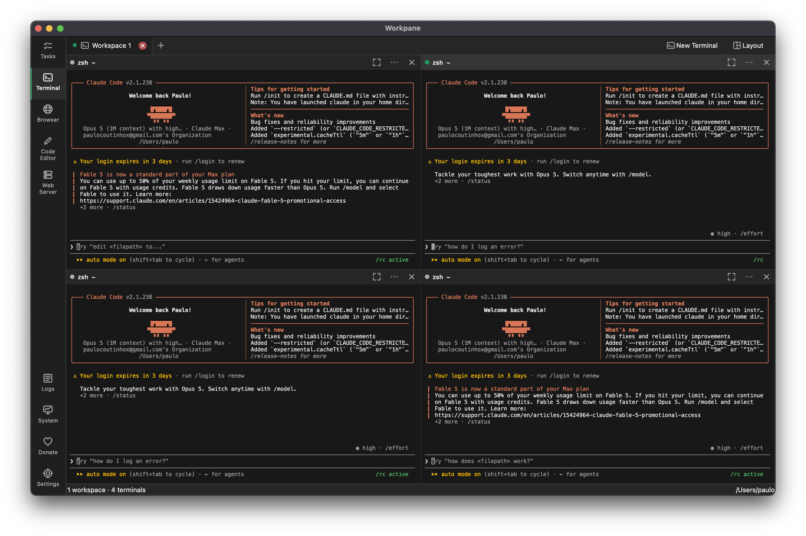
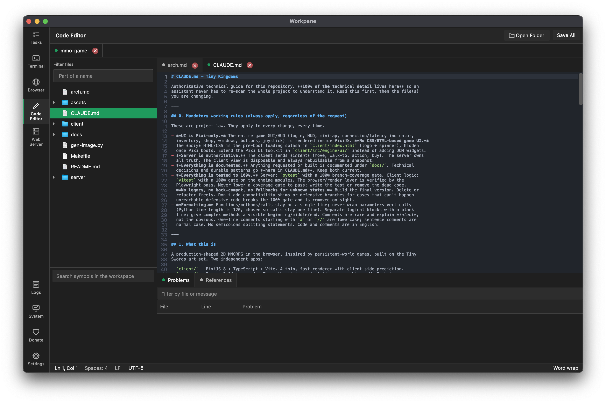
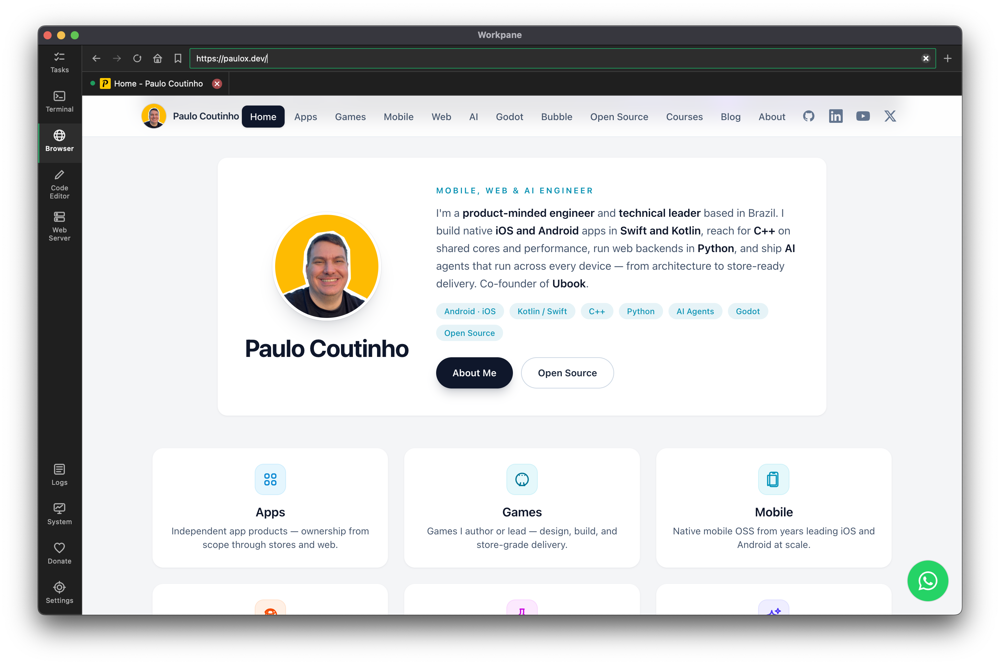
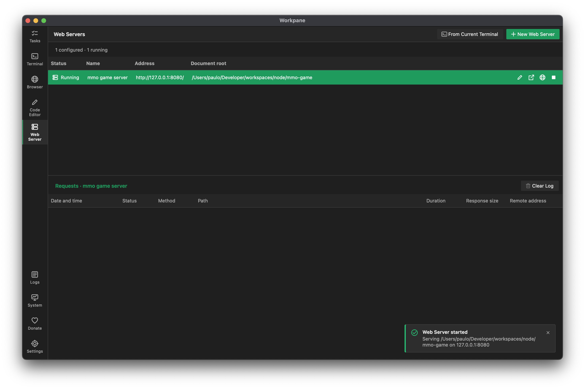
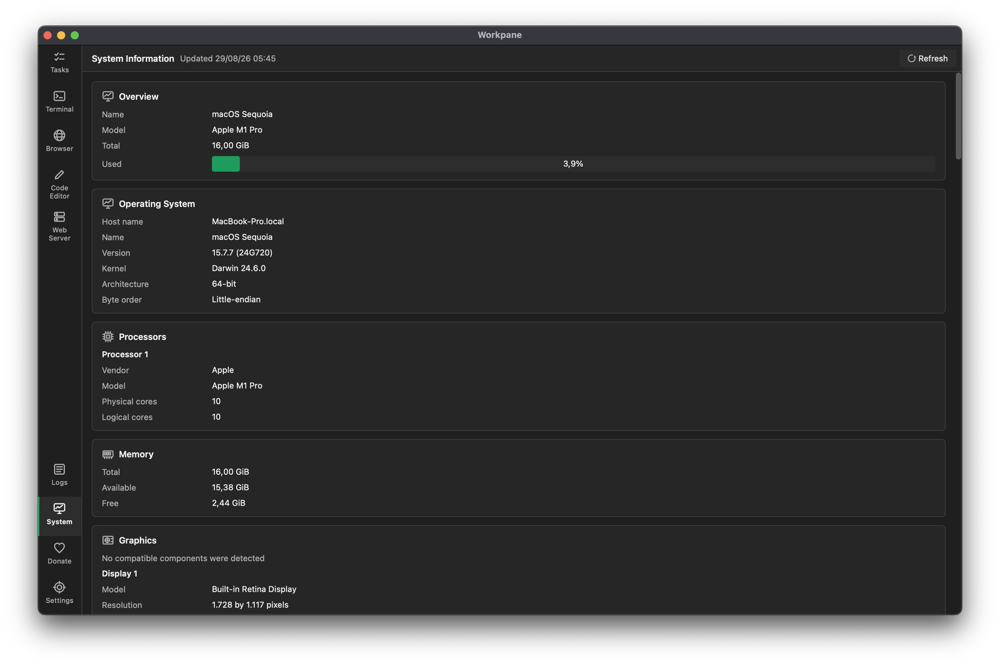
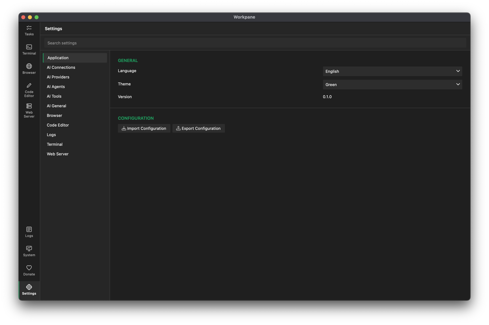

    

  
  
  
  
  

A plugin-first desktop workspace for terminals, code, browsing, AI agents and local development services.

 

## 🚀 Project

Workpane is one window for the things a project needs open at the same time: several shells, the files
you are editing, the page you are testing, the server serving it and the agent doing the long work.

Every feature is a plugin discovered at runtime. The core owns only startup, the shell, localization,
messaging, persistence and the visual primitives every plugin builds on — it does not know which
features exist. Everything is kept in one SQLite database and comes back exactly as you left it.

## ✨ Features

- [x] Terminal workspaces with layouts from one to twelve panes, a shelf and focus mode
- [x] Real shells through native PTY and ConPTY, with selection, search and bracketed paste
- [x] Code editor with folder workspaces, highlighting, EditorConfig and language servers
- [x] Embedded browser with persistent tabs and ordered bookmark groups
- [x] AI tasks where each task is a lasting conversation with an agent you wrote yourself
- [x] Agent tools for files, commands, the web, images, speech and Model Context Protocol servers
- [x] Per-provider request pacing shared by every workspace, with automatic backoff
- [x] Task scheduling by date, interval or POSIX cron, surviving restarts
- [x] Static web servers created from any folder, with request logging and lifecycle controls
- [x] Centralized logs, hardware and display information, and verified donation destinations
- [x] Green, Blue and Red themes applied without restarting anything
- [x] English and Portuguese, chosen from the system locale or explicitly
- [x] Strict SQLite persistence with per-plugin schemas and complete export and import
- [x] Native packages for macOS, Linux and Windows

## 📸 Screenshots

| | |
| :---: | :---: |
|  |  |
| **AI tasks** on a kanban board | **Terminal** in a four pane layout |
|  |  |
| **Code editor** with problems and symbols | **Browser** with persistent tabs |
|  |  |
| **Web servers** with request activity | **System information** and displays |
|  | |
| **Settings**, searchable and owned by each plugin | |

## 📚 Documentation

- [Getting started](docs/getting-started.md) — requirements, the first build and where the data lives
- [Architecture](docs/architecture.md) — what the core owns, how plugins are found and how they talk
- [Plugins](docs/plugins.md) — the eight features, and logs, system information and donate
  - [Terminal](docs/terminal.md) — workspaces, layouts, selection, search and what a program may ask for
  - [Code editor](docs/code-editor.md) — documents, encodings, EditorConfig, highlighting and language servers
  - [Browser](docs/browser.md) — tabs, bookmarks and being asked to open an address
  - [AI](docs/ai.md) — agents, conversations, tools, prompt templates, the model catalog, limits and scheduling
  - [Agent resources](docs/agent-resources.md) — the skills, commands, agents and context the agent reads
  - [Web server](docs/web-server.md) — serving, the request log and terminal integration
- [Development](docs/development.md) — the tasks, the gates, the audits and testing
- [Packaging](docs/packaging.md) — what a package contains and what validation checks

## ☕ Buy me a coffee

Support the continuous development of this project.

## 💛 Made with love

Made with ❤️ by [Paulo Coutinho](https://github.com/paulocoutinhox) and every person who opens an issue,
sends a patch or tells us what broke.

## 📄 License

[MIT](http://opensource.org/licenses/MIT)

Copyright (c) 2026, Paulo Coutinho
