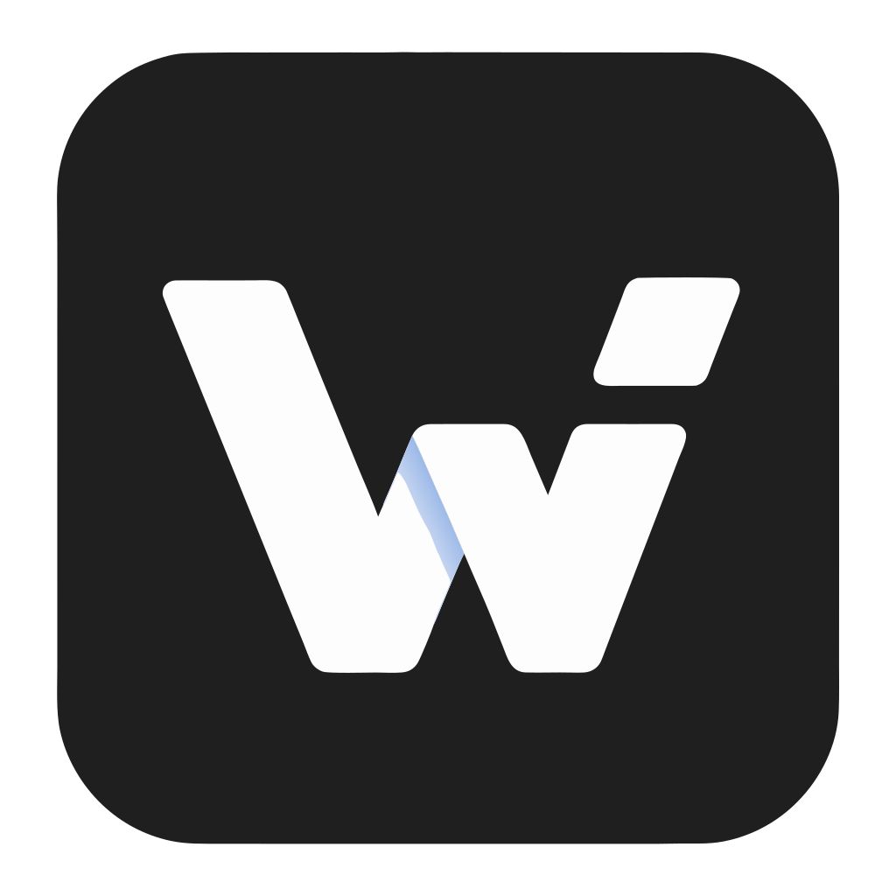
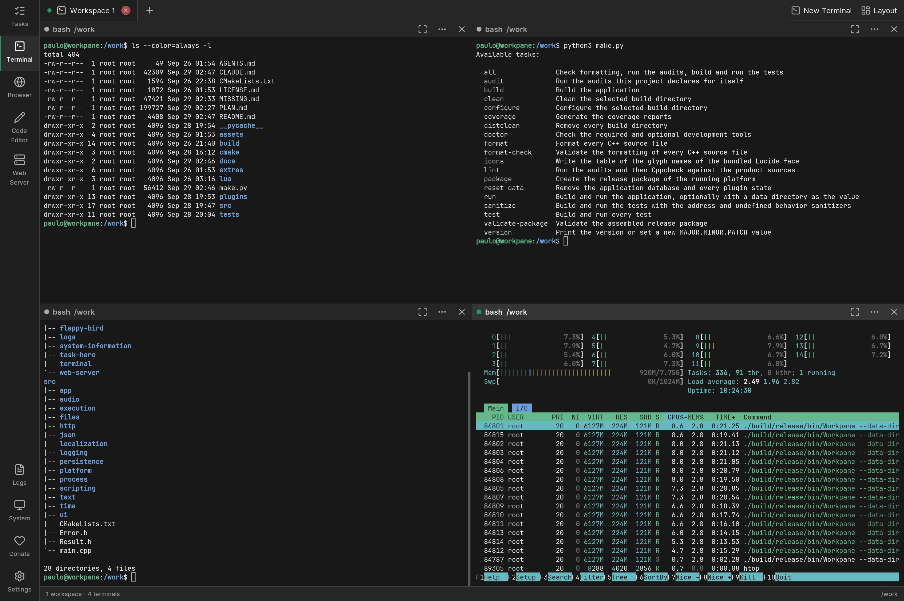
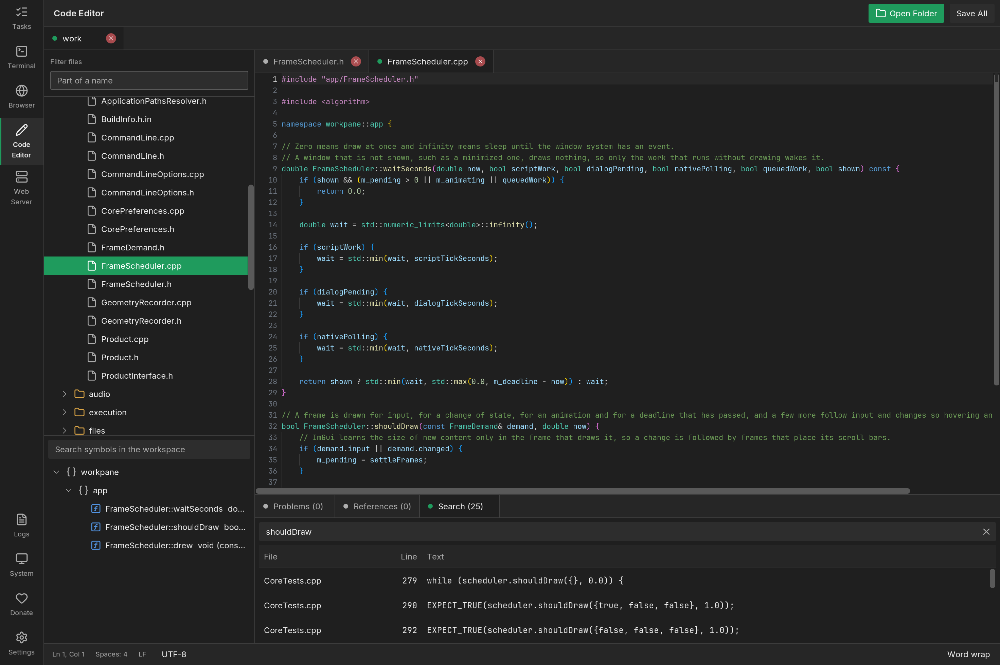
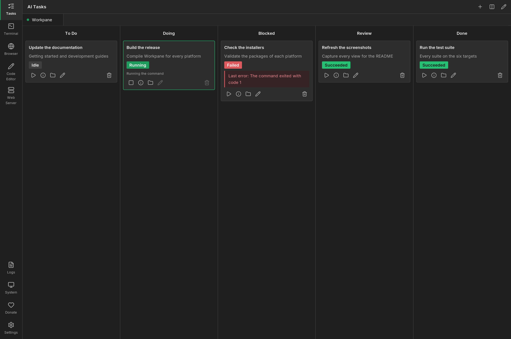
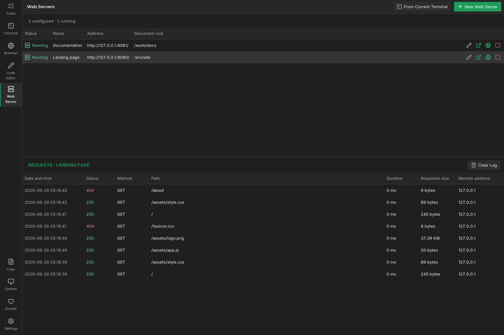
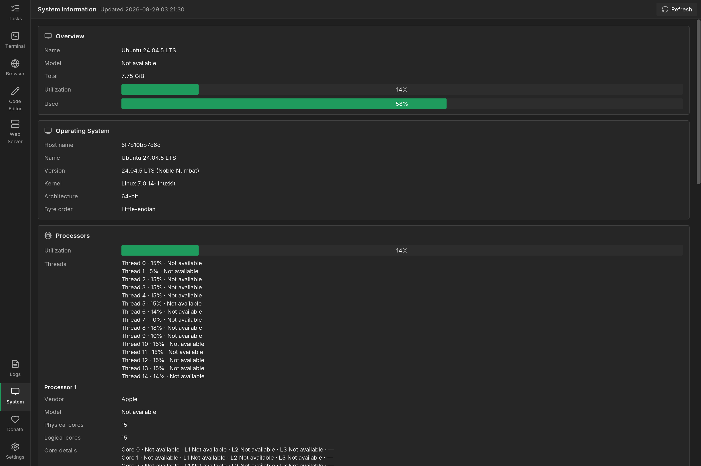
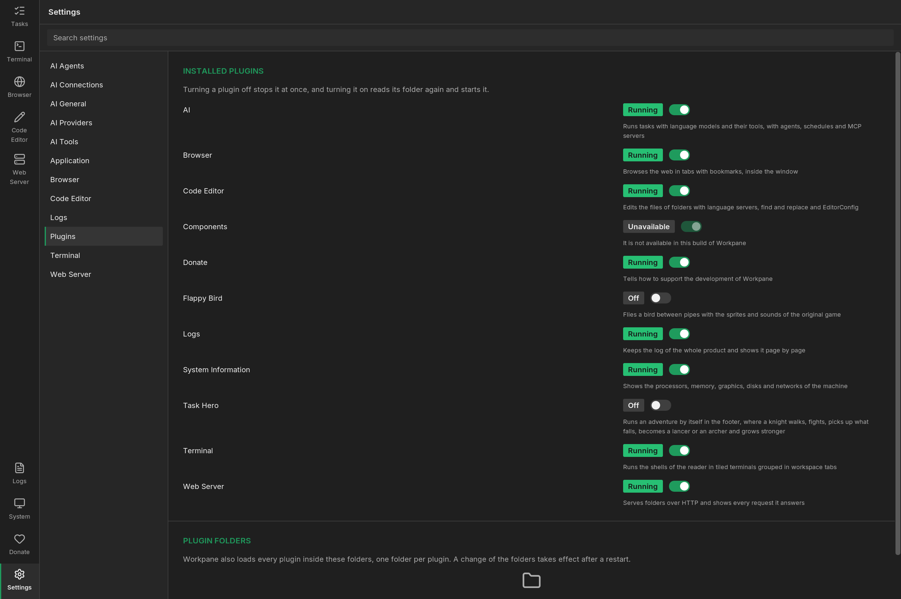
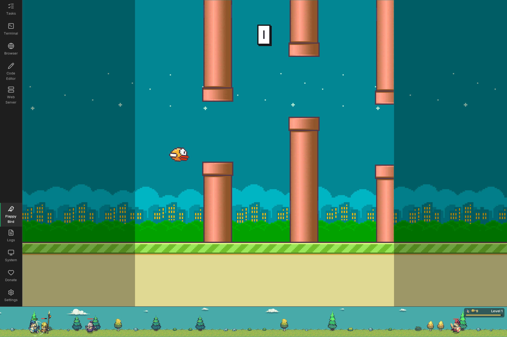

    

  
  
  
  
  

The native workspace for developers: terminals, code, browser, local servers and AI agents in one fast window.

 

## 🚀 Project

Building software today means juggling a terminal, an editor, a browser, a local server and, more and more, AI agents. Each one lives in its own window, and many are heavy web apps of their own.

Workpane brings them together in one native window, so the whole context of your work stays in one place. It is written in C++, drawn on the GPU, and every feature is a Lua plugin that you can turn on and off or write yourself.

## 💎 Why Workpane

- **Fast and light**: a native application that redraws only when something changes, so an idle window costs almost nothing.
- **Built to keep running**: every feature is an isolated plugin, and one that fails is stopped and reported while the rest keeps working.
- **Your work comes back**: tabs, layouts and settings are saved as you go, and a session that ended abruptly is restored on the next start.
- **Your data stays yours**: everything lives in one local database that you can export and import, and AI runs on the providers you choose, local models included.
- **Open to extension**: your own plugins use the same Lua API as the ones that ship with Workpane.
- **Proven on every platform**: every change passes hundreds of automated tests on macOS, Linux and Windows, on x86_64 and arm64.

## ✨ Features

- [x] Terminal
- [x] Code editor
- [x] Web browser
- [x] AI agents
- [x] Web server
- [x] System information
- [x] Logs
- [x] Plugins in Lua

## 📸 Screenshots

| | |
| :---: | :---: |
|  |  |
| **Terminal** | **Code editor** |
|  |  |
| **Web browser** | **AI agents** |
|  |  |
| **Web server** | **System information** |
|  |  |
| **Settings** | **Flappy Bird** and **Task Hero** |

## 📥 Download

Get the installer for your system from the [latest release](https://github.com/workpane/workpane/releases/latest).

## 📚 Documentation

- [Getting started](docs/getting-started.md) — download, build, run and where your data lives
- [Development](docs/development.md) — the commands, the sources, the checks and releases
- [Architecture](docs/architecture.md) — how the C++ and Lua halves fit together
- [Plugins](docs/plugins.md) — how to write a plugin
- [Components](docs/components.md) — every component a plugin can use

## ☕ Buy me a coffee

Support the continuous development of this project.

## 💛 Made with love

Made with ❤️ by [Paulo Coutinho](https://github.com/paulocoutinhox) and every person who opens an issue, sends a patch or tells us what broke.

## 📄 License

[MIT](LICENSE.md)

The bundled fonts, icons, sprites and sounds keep their own licenses, listed beside them: Inter and JetBrains Mono under the SIL Open Font License, Lucide under the ISC License, the Flappy Bird assets of Samuel Custodio under the MIT License and the Tiny Swords pack by Pixel Frog.

Copyright (c) 2026, Paulo Coutinho
